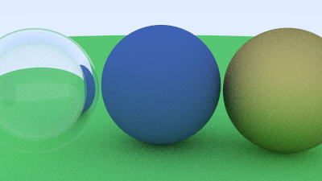

**C++ Ray Tracer**
==================

### **Overview**

This project is a comprehensive **ray tracing engine** implemented in C++. It builds upon Peter Shirley's *Ray Tracing in One Weekend* series and introduces enhancements to achieve realistic rendering, including Gaussian sampling for anti-aliasing, motion blur, and procedural textures.

### **Features**

-   **Gaussian Sampling for Anti-Aliasing**: Enhances image quality by smoothing pixel colors using a Gaussian distribution.
-   **Materials & Shading**: Supports Lambertian (diffuse), Metal, Emissive and Dielectric materials for realistic lighting and reflections.
-   **Motion Blur**: Simulates realistic motion blur for objects in motion within the scene.
-   **Depth of Field**: Implements focus effects using a thin lens camera model.
-   **Procedural Textures**: (Planned) Generates patterns (like checkerboards) directly in code.
-   **Dynamic Camera**: Configurable field of view, focus distance, and aspect ratio.
-   **Bounding Volume Hierarchy (BVH)**: (Planned) Optimize rendering by accelerating ray-object intersections.

### **Getting Started**

#### **Prerequisites**

-   C++17 or later
-   A modern C++ compiler (e.g., `g++`, `clang++`)
-   `cmake` for build management

#### **Build Instructions**

1.  Clone the repository:

    ```bash
    git clone https://github.com/your-username/cpp-ray-tracer.git
    cd cpp-ray-tracer`
    ```

2.  Create a build directory and compile:

    ```bash
    mkdir build && cd build
    cmake ..
    make
    ```

3.  Run the program:

    ```bash

    ./raytracer
    ```

### **Key Files and Directories**

-   **`src/`**: Contains the main source code files.
    -   `main.cc`: Entry point of the application.
    -   `camera/`: Camera and related logic.
    -   `core/`  : Contains logical components for vectors and intervals
    -   `objects/`: Contains all hittable objects like spheres and materials.
    -   `utils/`: Helper functions and utilities.
-   **`header/`**: Contains header files for the project.
-   **`build/`**: Compiled binaries and object files.

### **Next Steps**

Rendered scenes include ground planes, spheres, and complex lighting effects.

**1\. Three Spheres with Diffuse, Metal, and Hollow Materials**



A hollow glassy ball, a simple ball with lambertian diffusion and a metallic gold ball

**2\. Complex Scene with Cube and Tetrahedron**


**3\. Emissive Sphere Scene**


**4\. Final Render from Ray Tracing in One Weekend**


### **Next Steps**

-   Add support for **real-time ray tracing** using Apple Metal or OpenGL and using GPU based rendering rather than CPU based.
-   Implement **path tracing** for global illumination.
-   Optimize rendering with **BVH** for faster scene traversal.
-   Adding in some more optimizations from Ray Tracing The Next Week

### **License**

This project is open-source and available under the MIT License.

### **Acknowledgments**

Inspired by the *Ray Tracing in One Weekend* series by Peter Shirley.